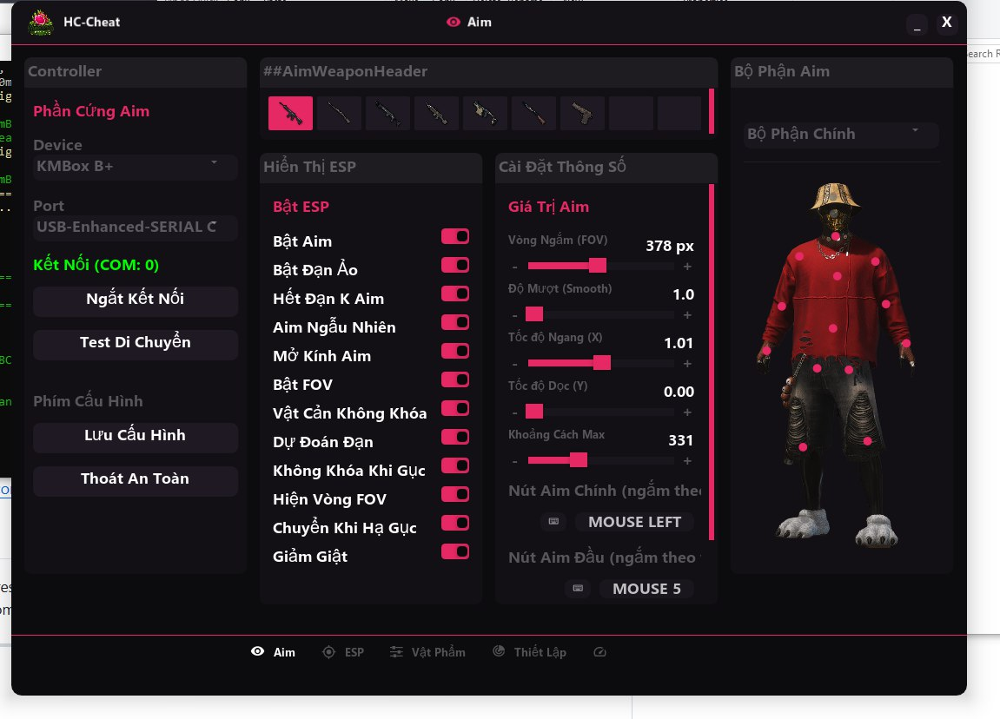
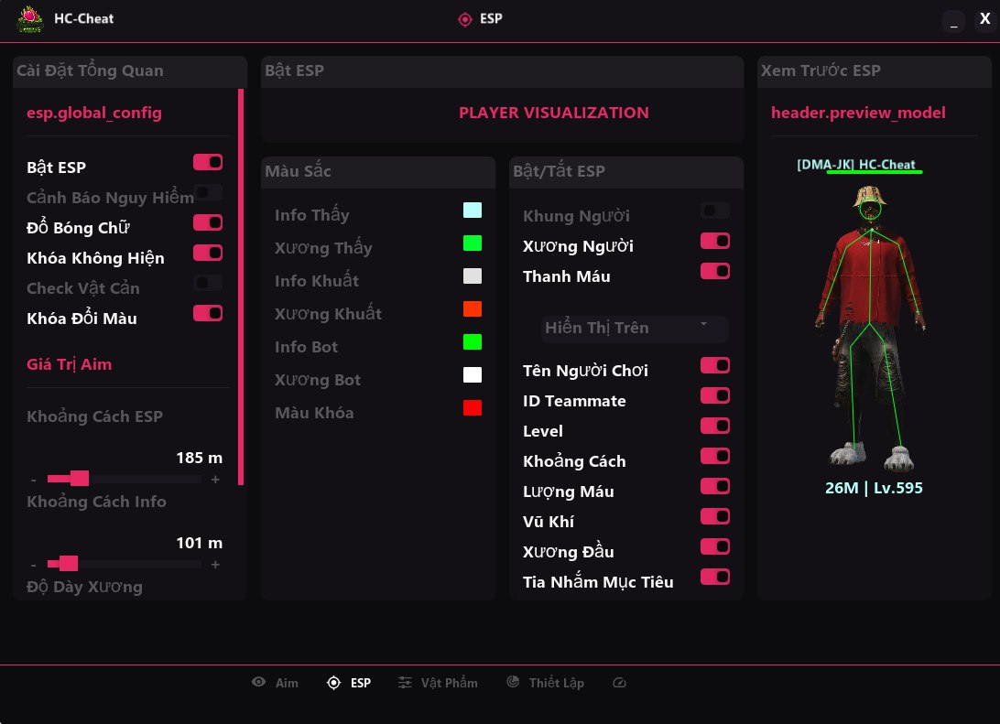
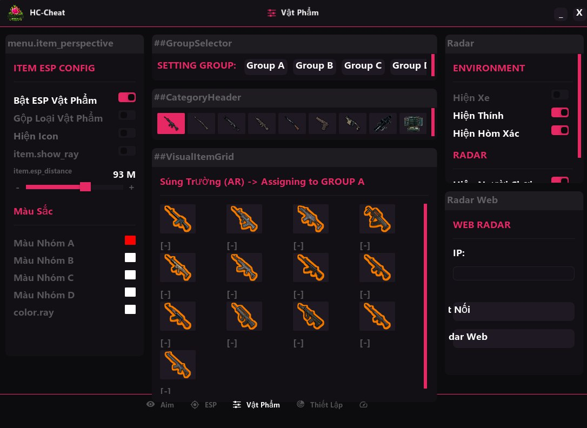

# PUBG-DMA (Direct Memory Access)

A high-end PUBG-DMA project designed for research, educational purposes, and testing Direct Memory Access technology.

## 🚀 About DMA Technology
Unlike conventional software, **PUBG-DMA** utilizes specialized hardware (DMA Card) to read game memory directly from the PCIe bus without involving the Game PC's CPU.
- **Absolute Safety:** Operates completely invisible to Anti-Cheat systems on the Game PC (such as BattlEye, EAC).
- **Zero Performance Impact:** No FPS drops or lag on the gaming machine because all graphics processing and calculations are performed on a second computer (Radar PC).

## 🛠 Key Features
The project integrates a comprehensive suite of professional tools:
- **Advanced ESP:** Skeleton, Box, Distance, Names, and Enemy Health with ultra-low latency.
- **Item & World ESP:** Precise location of weapons, gear (Armor/Helmet Lv3), Airdrops, vehicles, and other essential items with intuitive icons.
- **Aimbot & Prediction:** Shooting assistance with advanced Bullet Prediction algorithms based on the professional PhysX library for long-range accuracy.
- **Mini Radar:** A top-down radar showing the full view of enemies and vehicles around you.
- **Loot Filter:** Customizable smart item display according to your needs.
- **Multi-Language Support:** Supports both **English** and **Vietnamese**. You can change the language in the settings tab.

## 🎮 How to Use
Follow these hotkey instructions during gameplay:
- **Press `F5`:** To start/inject the software when you are in the game.
- **Press `F6`:** To safely exit and close the software.
- **Press `Ins` (Insert):** To toggle the Black Overlay.

## 📜 Changelog
- **06/03/2026: Aimbot Enhancements & Bug Fixes**
    - **Fixed Auto-Aim while Sprinting:** Resolved an issue where the mouse would pull (Aim) while holding Shift to sprint without a weapon equipped. Added a check for weapon status.
    - **Improved Hotkey Logic:** Fixed a bug where Aimbot would activate even if no key was configured (defaulted to Shift). Aimbot now only triggers when the specific configured key is pressed.
    - **Inventory & Map Protection:** Added a feature to automatically pause Aimbot when the Inventory (Tab) or Map (M) is open, allowing for smooth navigation and marking.
- **05/03/2026:** Official public release, free to use for the community.

## 📸 Menu Demo

## 🔄 Update Status
**Note:** This project is **updated daily** to improve features, update offsets, and ensure optimal performance. Please follow the repository regularly for the latest updates.

## 💬 Community & Discussion
Join our Discord for discussions, support, and the latest news:
- **Discord Link:** [https://discord.gg/t6TPNzP46B](https://discord.gg/t6TPNzP46B)

## ⚠️ Disclaimer
This software is provided for research and educational purposes only. The author is not responsible for any account bans or damages resulting from the use of this software. Users use it entirely at their own risk.

---
© 2026 phao0bao
